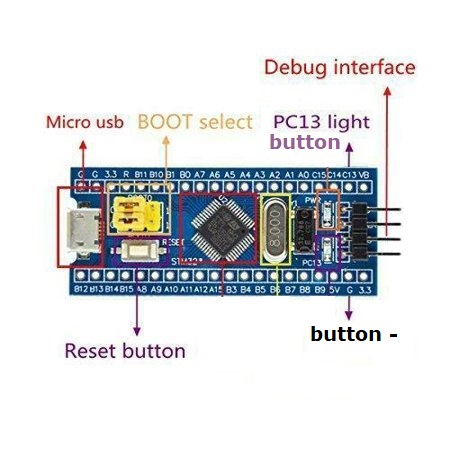

# USB-Button
### HID device based on STM32F103

This firmware implements one-button usb keyboard. It allows to add custom hardware button to Windows\Linux host-system.

### Connection

Hardware button should be connected between __PC13__ pin and __GND__. Pressing the button will cause sending keycode combination `GUI + O` (i.e. `WIN + O` for Windows) to USB-host system.

